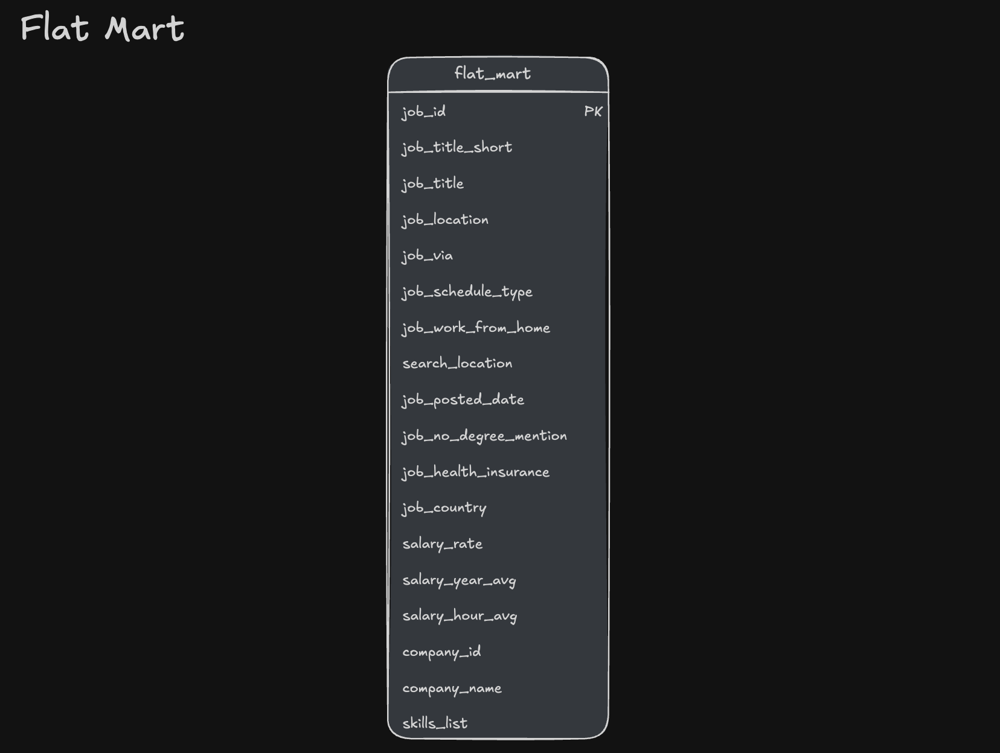

# 🏗️ Data Warehouse & Mart Build: Production ETL Pipeline

An end-to-end data engineering pipelein that transforms raw CSV files from a publicly shared Google Cloud Storage into a normalized star schema data warehoues. Then associated data marts were built using that data warehouse for analytics or business needs. 

  

## Executive Summary
- ✅ **Pipeline scope:** Built a complete **ETL Pipeline** from raw CSVs to star schema warehouse to analytical marts
- ✅ **Data modeling:** Designed a **star schedma** with fact tables, dimensions, and bridge tables for many-to-many relationships
- ✅ **ETL Development:** Implemented **extract, transform, load** processes with idempotent operations and data quality checks
- ✅ **Mart Architecture:** Created **specialized data marts** (flat, skill, priority) with additive measures and incremental update patterns

## 🧩 Problem and Context
Raw job posting data arrives as flat CSV which is not ideal for analytical querying or for business needs. Analysts need to answer:  
- Which skills are most in-demand over time?
- What are hiring trends by company and locations?
- How do salary patterns vary by role and skill?  

**Challenge:** Data teams need a single source of truth system —a data warehouse—to enable consistent, reliable analysis across the organization. Additionally, specialized data marts are required to optimize resources by pre-aggregating data for specific business use cases, reducing query complexity and improving performance for common analytical patterns.

**Solution:** End-to-end ETL pipeline that extracts CSVs from cloud storage, normalizes them into a star schema warehouse (separating facts from dimensions), and creates specialized data marts optimized for specific use cases (flat queries, skill demand analysis, priority role tracking).

## 🧰 Tech Stack

- 🐤 Database: DuckDB (file-based OLAP database with GCS integration via httpfs)
- 🧮 Language: SQL (DDL for schema design, DML for data loading and transformation)
- 📊 Data Model: Star schema (fact + dimension + bridge tables)
🛠️ Development: VS Code for SQL editing + Terminal for DuckDB CLI execution
- 🔧 Automation: Master SQL script for pipeline orchestration
- 📦 Version Control: Git/GitHub for versioned pipeline scripts
- ☁️ Storage: Google Cloud Storage for source CSV files

## 🏗️ Pipeline Architecture
  
The pipeline transforms job posting CSVs from Google Cloud Storage into a normalized star schema data warehouse, then builds specialized analytical data marts. BI tools (Excel, Power BI, Tableau, Python) consume from both the warehouse and marts.

### Data Warehouse
The Data warehouse is built using a star schema with `job_postings_fact` as our main table with `skills_dim`, `company_dim`, and `skills_job_dim` as supporting dimension tables

  

- **SQL Files:**
    - [`01_create_tables_dw.sql`](./01_create_tables_dw.sql) - Defines star schema with 4 core tables
    - [`02_laod_schema_dw.sql`](./02_load_schema_dw.sql) - Extracts CSVs from public Google Cloud and loads into warehouse tables
- **Purpose:** Star Schema serving as dingle source of truth for analytical queries
- **Grain:** One row per job posting in the fact table (`job_postings_fact`)

### Flat Mart
Denormalized table with all dimentions for ad-hoc queries

- **SQL Files:**
    - [`03_create_flat_mart.sql`](./03_create_flat_mart.sql) - Builds denormalized tables with all associated dimension tables. 
- **Purpose:** Ideal for business users with limited SQL knowledge to perform ad-hoc queries
- **Grain:** One row per job with all dimensions joined

### Skills Mart
Time-series skill demand analysis with additive measures. 

- **SQL Files:** [`04_create_skills_mart.sql`](./04_create_skills_mart.sql) - Builds time-series skill demand mart
- **Purpose:** Time-series skill demand analysis with additive measures. 
- **Grain:** `skill_id + month_start_date + job_title_short`
- **Key Features:** All measures are additive (counts/sums) for safe re-aggregation

### Priority Mart
Priority role tracking with incremental updates using `MERGE` operations.

- **SQL Files:**
    - [`05_create_priority_mart.sql`](./05_create_priority_mart.sql) - Initial build of priority roles and jobs snapshot
    - [`06_update_priority_mart.sql](./06_update_priority_mart.sql) - **Incremental update using MERGE** (upser pattern) 
- **Purpose:** Track priority roles and job snapshots with incremental update capabilities
- **Grain:** One row per job with priority level assignment
- **Key Feature: MERGE operations for incremental updates** - demonstrates production-ready upsert patterns (`INSERT`, `UPDATE`, `DELETE` in single statment accomplished using the `MERGE` method)

## 💻 Data Engineering Skills Demonstrated

### ETL Pipeline Development 
- **Extract:** Direct CSV loading from a public Google Cloud Storage using DuckDB's `httpfs` extension
- **Transform:** Data normilization, type conversion (`CAST`, `DATE_TRUNC`) and quality filtering
- **Load:** Idempotent table creation with `DROP TABLE IF EXISTS` and `DROP SCHEMA IF EXISTS` patterns
- **Incremental Updates:** `MERGE` operation to accomplish `INSERT`, `UPDATE`, `DELETE` upsert in single statment
- **Orchestration:** Master SQL script (`build_dw_marts.sql`) for automated pipeline execution. 

### Dimensional Modeling 
- **Star Schema Design:** Fact Table (`job_postings_fact`) with dimension tables (`company_dim`, `skills_dim`)
- **Bridge Tables:** Many-to-many relationship hadling (`skills_job_dim`)
- **Grain Definition:** Proper fact table granularity(skill+month, company+title+location+month)
- **Additive Measures:** Counts and sums that can be safely re-aggregated at any level

### SQL Advanced Techniques
- **DDL Operations:** `CREATE TABLE`, `DROP TABLE`, `CREATE SCHEMA` for schema management
- **DML Operations:** `INSERT INTO ... SELECT` with explicit column mapping from CSV sources 
- **MERGE Operations:** Incremental updates using `MERGE INTO` with `WHEN MATCHED`, `WHEN NOT MATCHED`, and `WHEN NOT MATCHED BY SOURCE` clauses for production-ready upsert patterns
- **CTEs and Subqueries:** Common Table Expressions for complex transformations and boolean flag conversion
- **Date Functions:** `DATE_TRUNC('month')`, `EXTRACT(quarter)` for temporal dimension creation
- **Boolean Logic and String Functions:** `CASE WHEN` conversions for aggregating flags or to add logic to string values. 

### Data Quality & Production Practices

- **Idempotency:** All scripts safely rerunnable without side effects
Data Validation: Verification queries at each pipeline step to ensure data integrity
- **Type Safety:** Proper data type definitions (`VARCHAR`, `INTEGER`, `DOUBLE`, `BOOLEAN`, `TIMESTAMP`)
- **Schema Organization:** Separate schemas (`flat_mart`, `skills_mart`, `priority_mart`, `company_mart`) for logical separation
- **Progress Reporting:** Structured script execution with clear progress reporting